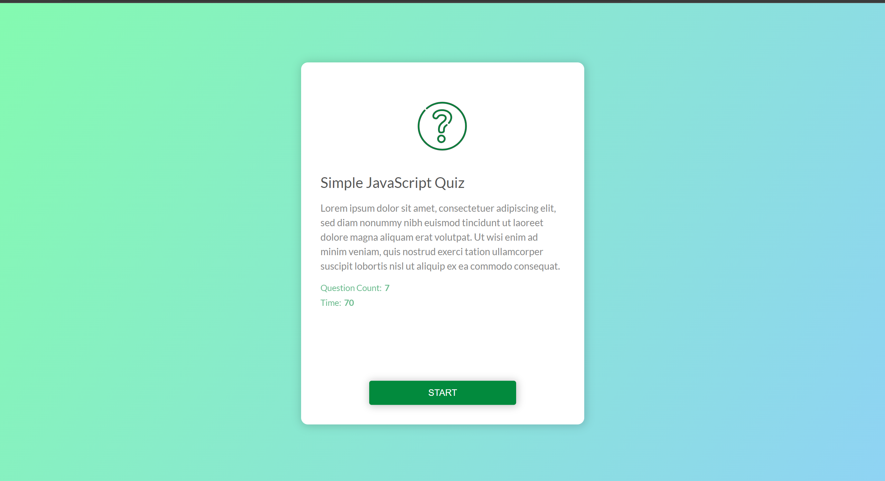
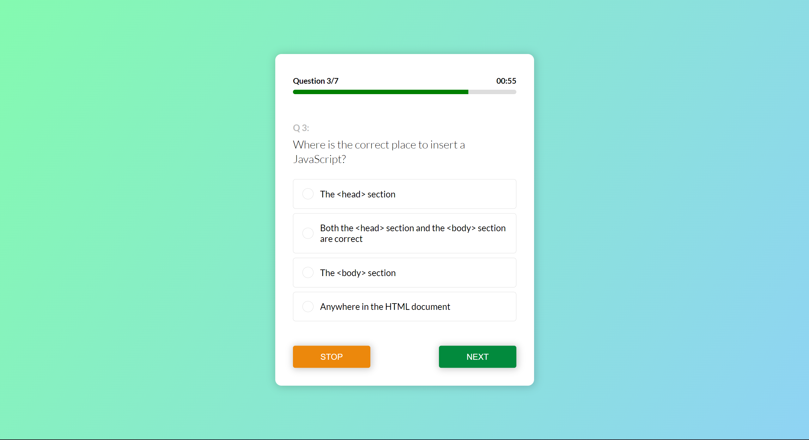
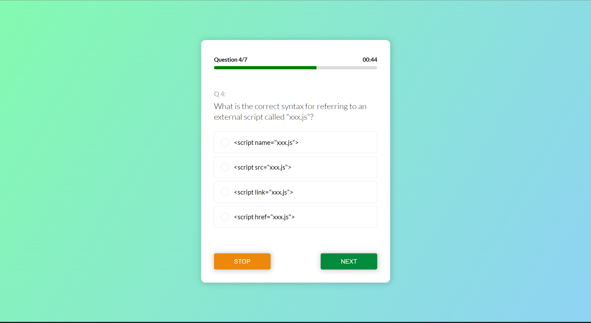
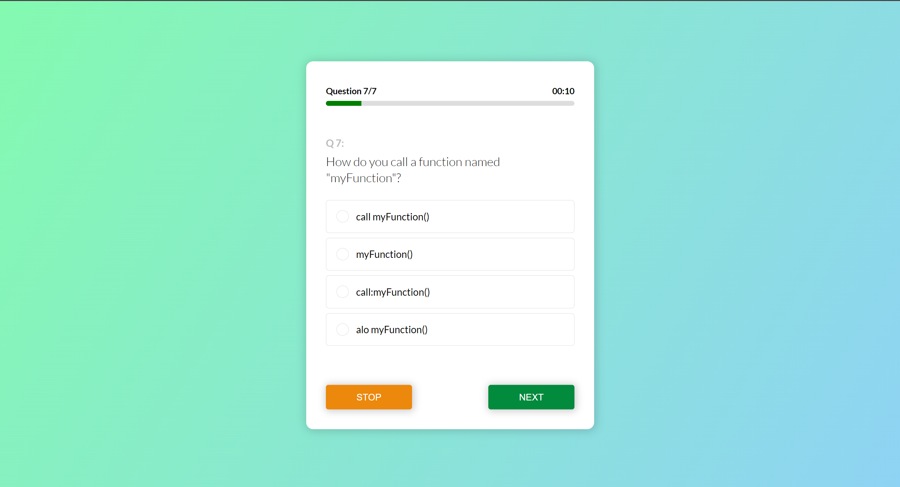

# Quiz website
It is a simple javascript website to test your knowledge on javascript. 

Special topics covered:  
  Object Oriented Programming (OOP)  
  Creating and handling DOM elements  
  CSS animation
  
  
  
    
      
        
          
            
              
                
