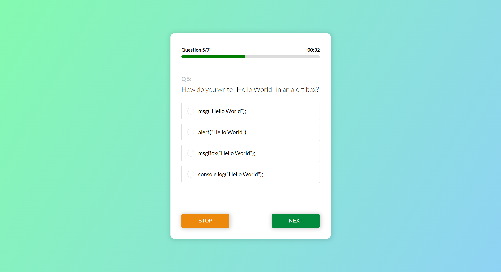

# Quiz website
It is a simple javascript website to test your knowledge on javascript.  

It is a multiple-choice quiz consisting of 7 questoins. The quiz begins with a start button. You will be given 70 seconds to answer all the questions.

#Technologies used:  
HTML  
CSS  
JAVASCRIPT  

Special topics covered:  
  Object Oriented Programming (OOP)  
  Creating and handling DOM elements  
  CSS animation
  
  
  
    
      
        
          
            
              
                
